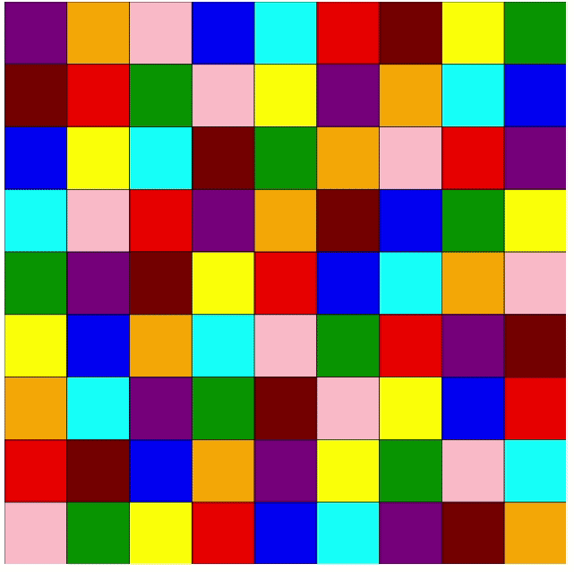
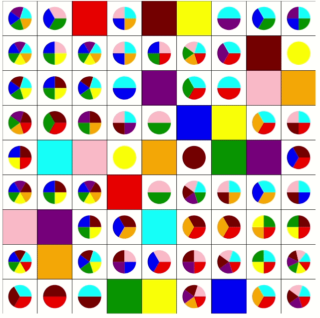
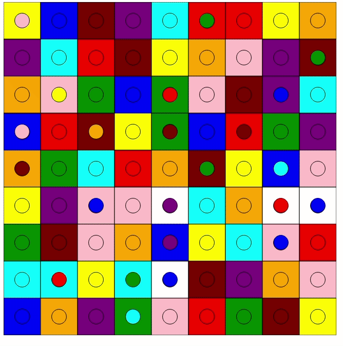

# ColorSudoku
A Javascript based sudoku solver using d3.js

- I would like to make this solver more moduler such that more complex rules can be implemented.  Right now, I am using only process of elimination from row/column/box to determine color placement.

- Using d3.js, I am able to allow the user to select a color for a given cell.  The solver then proceeds with that choice.  

- The solver recognizes when all possible colors are eliminated from a cell and will alert that the puzzle has failed and place an X over the offending cells

- The solver is built to be expandable to 4x4, 5x5 puzzles and beyond.  Right now I have 25 colors available but will need to expand to 36 or 49 colors to play with 6x6 or 7x7 puzzles

- There is a data file called challenge.js that holds puzzles the solver can try to solve.  The 4x4 and 5x5 puzzles are just place holders and are not actual solveable puzzles.  They are simply proof of concept for larger boards.

Things TODO:
- Add colored circular nodes to move between squares
- Add a softer measurment (Whatever that means)
- Fail more gracefully when a puzzle breaks the rules
- Fail when two cells in the same row or coloumn require the same color
- Obtain a solveable 4x4 and 5x5 sudoku puzzle

Things I want:
Use d3.js forces to move colored circular nodes to new homes
Backtrack to last move

## These are examples of the code as it works now

### Working Example

### Working Example with color choice

### Bad Working Example with color choice

Notice there are two maroon in one row.  The solver does not catch that, but continues

## This is an older version

I have not included the code for the nodes to move because the logic is broken.  But this is the effect I would like to have

### Bad Working Example with color choice

